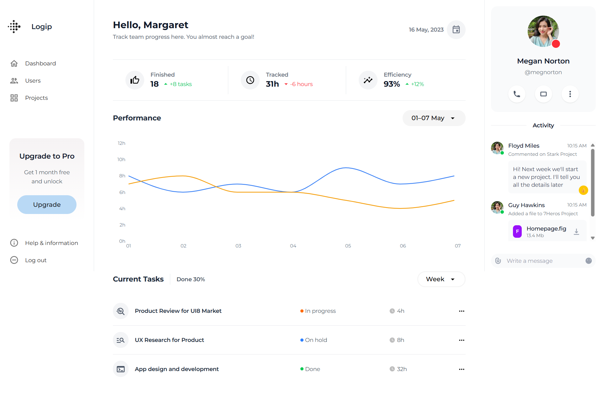
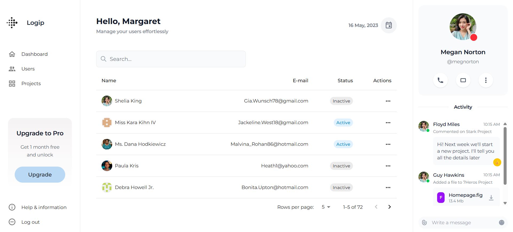

# Dashboard & Users App (React + MUI)

This is a simple React-based dashboard with two routes: `Home` and `Users`. The app uses mock data and implements basic UI components using Material UI (MUI) and Tailwind CSS.

---

### 🏠 Home (`/`)

- Displays the main **Dashboard**.
- Includes greeting, statistics tiles, line chart and tasks.

### 👤 Users (`/users`)

- Shows a full paginated list of users.
- Integrates **MUI Table** with pagination using hardcoded total count (`72`) since the mock API didn’t provide it.

---

## 📦 Tech Stack

- React
- TypeScript
- Tailwind CSS
- Material UI (MUI)
- MockAPI for sample data

---

## 📝 Notes

- Pagination won't function correctly without a proper total count from the API — hence it is disabled during search in Users

## ⚙️ Setup

```bash
git clone <repo-url>
yarn install
yarn dev
